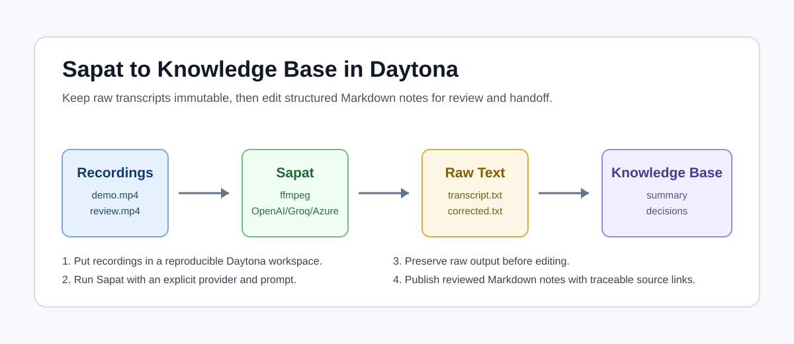

# Turn Sapat Transcripts Into a Knowledge Base

# Introduction

Raw transcripts are useful for search, but they are rarely useful enough for a
team on their own. A 45 minute demo, architecture review, incident walkthrough,
or customer interview usually contains decisions, commands, links, names,
open questions, and follow-up tasks mixed into long paragraphs. If you only
save the transcript, every reader has to do the same cleanup again.

This guide shows how to use [Sapat](https://github.com/nkkko/sapat) inside a
[Daytona workspace](../definitions/20240819_definition_daytona workspace.md)
to turn video recordings into a small
[transcript knowledge base](../definitions/20260511_definition_transcript_knowledge_base.md).
The workflow keeps the transcription step reproducible, then adds a simple
structure around the resulting `.txt` files: metadata, summaries, chaptered
notes, commands, glossary terms, decisions, and action items. The goal is not to
replace editorial judgment. The goal is to make recordings easier to review,
search, and hand off to another engineer.

Sapat is a Python command-line tool that converts video files to MP3 with
ffmpeg, sends the audio to a supported transcription provider, and writes a
text transcript beside each input file. The current implementation supports
OpenAI, Groq, and Azure OpenAI through the required `--api` flag. It can process
one file or every `.mp4` file in a directory, and it includes an optional
`--correct` pass that uses a chat model to clean up the transcript text.

## TL;DR

- Create a Daytona workspace from the Sapat repository so the tooling and
  commands run in a repeatable environment.
- Configure one transcription provider with environment variables in `.env`.
- Run Sapat against a single `.mp4` file first, then use directory mode for a
  batch of recordings.
- Convert each generated `.txt` transcript into a structured Markdown note with
  metadata, chapters, decisions, commands, questions, and action items.
- Keep raw transcripts immutable and edit the derived notes, so reviewers can
  compare cleanup against source text.

## What You Will Build

By the end of this guide you will have a workspace layout like this:

```text
sapat/
  recordings/
    api-design-review.mp4
    customer-demo.mp4
  transcripts/
    api-design-review.txt
    customer-demo.txt
  knowledge-base/
    api-design-review.md
    customer-demo.md
    index.md
```

The `recordings` directory stores the source videos. The `transcripts`
directory stores raw Sapat output. The `knowledge-base` directory stores the
human-readable Markdown notes that your team can review or publish internally.



## Prerequisites

You need the following:

- A GitHub account.
- Daytona installed and authenticated. Follow the
  [Daytona CLI guide](https://www.daytona.io/docs/en/tools/cli/)
  if you do not already have it.
- [Python](../definitions/20240820_defintion_python.md) 3.6 or newer.
- ffmpeg available in the workspace.
- One supported transcription
  [API](../definitions/20241212_definition_api.md): OpenAI, Groq, or Azure
  OpenAI.
- A short `.mp4` test recording that is safe to send to your selected provider.

Do not put confidential recordings into this workflow unless your provider,
workspace, and company policies allow it. Sapat sends audio to the selected
third-party transcription API.

## Step 1: Create the Daytona Workspace

Create a workspace directly from the Sapat repository:

```bash
daytona create https://github.com/nkkko/sapat --code
```

Open a terminal inside the workspace and confirm that you are in the repository
root:

```bash
pwd
ls
```

Install Sapat in editable mode:

```bash
python -m pip install -e .
```

Then check the command-line interface:

```bash
sapat --help
```

The help output should show these important options:

- `--api`: required, one of `openai`, `groq`, or `azure`.
- `--quality`: MP3 conversion quality, one of `L`, `M`, or `H`.
- `--language`: source audio language, defaulting to `en`.
- `--prompt`: optional transcription prompt for domain-specific vocabulary.
- `--temperature`: transcription sampling temperature, defaulting to `0.3`.
- `--correct`: optional chat-model correction pass.

## Step 2: Add Provider Credentials

Sapat loads provider settings from a `.env` file in the repository root. Start
with only the provider you plan to use. This keeps the configuration easier to
audit and avoids guessing which provider is active.

For OpenAI:

```bash
cat > .env <<'EOF'
OPENAI_API_KEY=replace-me
OPENAI_MODEL=whisper-1
OPENAI_API_ENDPOINT=https://api.openai.com/v1/audio/transcriptions
OPENAI_MODEL_NAME_CHAT=gpt-4o
EOF
```

For Groq:

```bash
cat > .env <<'EOF'
GROQCLOUD_API_KEY=replace-me
GROQCLOUD_MODEL=whisper-large-v3-turbo
GROQCLOUD_API_ENDPOINT=https://api.groq.com/openai/v1/audio/transcriptions
GROQCLOUD_MODEL_NAME_CHAT=llama3-8b-8192
EOF
```

For Azure OpenAI:

```bash
cat > .env <<'EOF'
AZURE_OPENAI_API_KEY=replace-me
AZURE_OPENAI_ENDPOINT=https://your-resource.openai.azure.com
AZURE_OPENAI_DEPLOYMENT_NAME_WHISPER=whisper
AZURE_OPENAI_API_VERSION_WHISPER=2024-06-01
AZURE_OPENAI_DEPLOYMENT_NAME_CHAT=gpt-4o
AZURE_OPENAI_API_VERSION_CHAT=2023-03-15-preview
EOF
```

The variable names above come from the current Sapat source. If the repository
changes, trust the source files over copied notes. The provider implementations
read configuration from `src/sapat/transcription/openai.py`,
`src/sapat/transcription/groq.py`, and `src/sapat/transcription/azure.py`.

## Step 3: Create a Transcript Workspace Layout

Create directories for source recordings, raw transcripts, and edited
knowledge-base notes:

```bash
mkdir -p recordings transcripts knowledge-base
```

Copy one small `.mp4` file into `recordings/` first. A short file keeps the
first test cheap and fast:

```bash
cp ~/Downloads/api-design-review.mp4 recordings/
```

Sapat writes the `.txt` output beside the input video. To keep raw recordings
and transcripts separate, run the first pass inside `recordings/`, then move
the transcript:

```bash
sapat recordings/api-design-review.mp4 \
  --api openai \
  --quality M \
  --language en \
  --prompt "API design review with product names and endpoint names" \
  --temperature 0.2

mv recordings/api-design-review.txt transcripts/
```

Use `--api groq` or `--api azure` if you configured one of those providers
instead. The `--prompt` value should include product names, people names,
acronyms, or technical terms that the transcription model may otherwise spell
incorrectly.

## Step 4: Decide When to Use the Correction Pass

Sapat can run a correction pass when you add `--correct`. In the current source,
that pass sends the generated text to a chat model for punctuation,
capitalization, and spelling cleanup. This can make transcripts easier to read,
but it also introduces a second model step.

Use `--correct` when:

- The recording is long enough that punctuation cleanup saves review time.
- You have included the relevant vocabulary in the prompt.
- Your provider and policy allow the text to be sent to a chat model.
- You still plan to review the corrected text against the raw transcript.

Skip `--correct` when:

- You need a source-of-truth transcript for compliance or review.
- The recording includes sensitive customer or incident details.
- You want to preserve every false start and repeated phrase.
- You are still testing provider setup and want fewer moving parts.

A practical compromise is to keep two files:

```bash
cp transcripts/api-design-review.txt transcripts/api-design-review.raw.txt
```

Then run a corrected version only after the raw transcript exists:

```bash
sapat recordings/api-design-review.mp4 \
  --api openai \
  --quality M \
  --language en \
  --prompt "API design review with endpoint names, SDK names, and owner names" \
  --temperature 0.2 \
  --correct

mv recordings/api-design-review.txt transcripts/api-design-review.corrected.txt
```

## Step 5: Turn the Transcript Into a Note

Create a Markdown note beside the raw transcript:

```bash
touch knowledge-base/api-design-review.md
```

Use this structure:

```markdown
---
title: "API Design Review"
source_recording: "../recordings/api-design-review.mp4"
raw_transcript: "../transcripts/api-design-review.raw.txt"
corrected_transcript: "../transcripts/api-design-review.corrected.txt"
date_recorded: "2026-05-11"
review_status: "needs-human-review"
---

# API Design Review

## Summary

Two or three paragraphs that explain why the recording matters.

## Chapters

- 00:00 - Context and agenda
- 04:15 - Current API behavior
- 18:40 - Proposed endpoint changes
- 31:20 - Follow-up work

## Decisions

- Decision:
  Use cursor pagination for the public endpoint.
  Evidence:
  The team rejected offset pagination because large accounts need stable page
  boundaries during sync jobs.

## Commands and Code References

- `curl /v1/projects/{id}/runs`
- `packages/api/src/routes/runs.ts`

## Open Questions

- Who owns the migration guide for existing SDK users?

## Action Items

- [ ] Draft endpoint migration note.
- [ ] Add SDK example for pagination.
- [ ] Confirm rate-limit wording with the API owner.

## Glossary

- Cursor pagination: pagination that uses a stable cursor token instead of a
  numeric page offset.
```

This note format separates interpretation from source material. The raw
transcript stays available for audit, while the Markdown note becomes the
working knowledge base entry.

## Step 6: Extract Durable Knowledge

Read the transcript once for structure, not polish. Mark the places where the
conversation changes topic. Then create the first draft of the knowledge-base
note in this order:

1. **Summary**: Write the shortest accurate explanation of the recording.
2. **Chapters**: Add timestamps or approximate sections so readers can jump
   back to the recording.
3. **Decisions**: Capture final choices and the reason behind each choice.
4. **Commands and Code References**: Pull out terminal commands, filenames,
   package names, and URLs.
5. **Open Questions**: Preserve unresolved discussion instead of hiding it.
6. **Action Items**: Convert follow-ups into checkboxes with clear verbs.
7. **Glossary**: Define recurring domain terms once.

Do not try to make the transcript beautiful before you extract structure. Long
transcripts contain repetition. Your knowledge base should remove repetition,
but it should not remove uncertainty. If a conclusion is unclear, mark it as an
open question.

## Step 7: Batch Process a Folder

After the single-file run is working, process a folder of `.mp4` files:

```bash
sapat recordings \
  --api openai \
  --quality M \
  --language en \
  --prompt "Engineering recordings with API names, package names, and customer terms" \
  --temperature 0.2
```

Sapat currently processes `.mp4` files when the input path is a directory. Move
the generated text files into `transcripts/`:

```bash
mv recordings/*.txt transcripts/
```

Create or update an index:

```bash
cat > knowledge-base/index.md <<'EOF'
# Transcript Knowledge Base

| Recording | Source | Note | Status |
| --- | --- | --- | --- |
| API Design Review | ../recordings/api-design-review.mp4 | ./api-design-review.md | needs review |
| Customer Demo | ../recordings/customer-demo.mp4 | ./customer-demo.md | needs review |
EOF
```

This table gives reviewers a queue. A transcript is not done when Sapat writes
the `.txt` file. It is done when the note has been reviewed and the action
items are ready for someone to own.

## Step 8: Review for Accuracy

Use a lightweight review checklist for every note:

- Does the summary match the recording?
- Are decisions written as decisions, not guesses?
- Are uncertain items listed under open questions?
- Do commands, filenames, URLs, and API names match the transcript?
- Are action items specific enough for another engineer to pick up?
- Does the note avoid exposing secrets, private customer data, or credentials?

If you use `--correct`, compare important sections against the raw transcript.
Correction models can improve readability, but they can also smooth over
hesitation or convert a tentative statement into something that sounds final.
For technical records, that difference matters.

## Common Issues and Troubleshooting

**Problem:** `sapat` is not found after installation.

**Solution:** Run `python -m pip install -e .` again and check that your Python
scripts directory is on `PATH`. In a fresh Daytona workspace, installing from
the repository root is usually enough.

**Problem:** ffmpeg is missing.

**Solution:** Install ffmpeg in the workspace image or base environment. Sapat
uses ffmpeg to convert video files into MP3 before calling the transcription
provider.

**Problem:** Sapat returns an authentication error.

**Solution:** Check the relevant provider variables in `.env`. For example,
OpenAI requires `OPENAI_API_KEY`, `OPENAI_MODEL`, and
`OPENAI_API_ENDPOINT`. Groq uses `GROQCLOUD_API_KEY`, and Azure OpenAI uses the
Azure endpoint, deployment names, API versions, and API key.

**Problem:** A transcript misses product names or API names.

**Solution:** Add those terms to `--prompt` and run a short test file again.
Prompts are most useful when they are specific: product names, endpoint names,
speaker names, acronyms, and internal terms.

**Problem:** Directory mode skipped files.

**Solution:** Confirm the files end in `.mp4`. The current directory mode uses
`*.mp4`, so other video extensions need to be converted or handled one file at
a time.

**Problem:** The knowledge-base note is too long.

**Solution:** Keep the full transcript in `transcripts/` and make the note a
navigation layer. The note should summarize, point to evidence, and list
actions. It does not need to repeat the entire transcript.

## Conclusion

Sapat handles the repetitive part of the workflow: converting videos, calling a
transcription provider, and writing text output. Daytona makes that workflow
repeatable by putting the repository, Python package, ffmpeg setup, and command
history in one workspace. The extra step is editorial structure. When you turn
raw transcripts into a small knowledge base, recordings become useful long
after the meeting ends.

The safest pattern is simple: keep source recordings, keep raw transcripts, and
edit a separate Markdown note. That gives your team both traceability and a
clean artifact they can search, review, and hand off.

## References

- [Sapat repository](https://github.com/nkkko/sapat)
- [Daytona documentation](https://www.daytona.io/docs/)
- [OpenAI speech-to-text documentation](https://platform.openai.com/docs/guides/speech-to-text)
- [Groq speech-to-text documentation](https://console.groq.com/docs/speech-to-text)
- [Azure OpenAI audio documentation](https://learn.microsoft.com/azure/ai-services/openai/audio-completions-quickstart)
